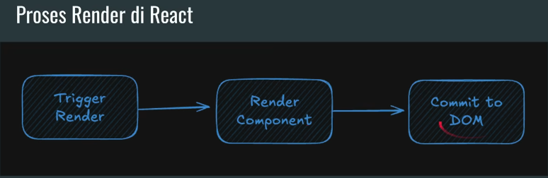

# 1-Learning-ReactJs-Introduction

- React uses JSX when creating Components
- JSX (JavaScript XML or JavaScript Syntax Extension) is a combination of JavaScript and XML (HTML) code, where we can easily create Components using XML and JavaScript code in a single file
- JSX was introduced by Facebook in React, but now JSX has been widely adopted by many other JavaScript Frameworks

## Create Project

- To create a React project, we will use Vite as the build tool.
- We can create a React project using several commands.
- To create a React project using JavaScript:

```zsh
npm create vite@latest application-name -- --template react
```

- To create a React project using TypeScript:

```zsh
npm create vite@latest application-name -- --template react-ts
```

[](https://vite.dev/guide#scaffolding-your-first-vite-project)

## Start Project

- To start the project, we can use the following command:

```zsh
npm run dev
```

### Component

- Usually, components are created in a single JSX file with a name corresponding to the component name.
  For example, if we want to create a component named HelloWorld,
  we can create a file called HelloWorld.jsx.
  Next, we need to create a default function with the component name, which is HelloWorld.
  The return value of this function is the UI element that will be displayed.

- React Components support all HTML and SVG elements.
- So we don't need to worry when creating Components, because all elements are definitely supported.
  [https://react.dev/reference/react-dom/components](https://react.dev/reference/react-dom/components)

#### Displaying Component

- To display a Component, an instance of React Root is required.

```js
import { StrictMode } from "react";
import { createRoot } from "react-dom/client";
import HelloWorld from "./HelloWorld.jsx";

createRoot(document.getElementById("root")).render(
  <StrictMode>
    <HelloWorld />
  </StrictMode>
);
```

- We can create React Root using the createRoot(element) method.
  [https://react.dev/reference/react-dom/client/createRoot](https://react.dev/reference/react-dom/client/createRoot)
- Next, to display a Component in React Root, we can use the render method. (component)
- To help troubleshoot issues during development, React provides the StrictMode component. We can use StrictMode to display components in the Root
  [https://react.dev/reference/react/StrictMode](https://react.dev/reference/react/StrictMode)

#### Multiple Component

- Previously, we created one JSX file for one Component.
- Although that is good practice, it does not mean it is mandatory.
- A Component is actually just a function that returns a React Element. Therefore, if we want to create a Component, we only need to create a function that returns a React Element.

```js
function HelloWorld() {
  return <h1>Hello, World!</h1>;
}

function App() {
  return (
    <div>
      <HelloWorld />
    </div>
  );
}
export default App;
```

## JSX

- Websites are built using HTML, CSS, and JavaScript. Typically, we store content in HTML, design in CSS, and application logic in JavaScript. And usually, we store them in separate files.
- But today, websites are more interactive, and often HTML content is displayed based on application logic in JavaScript.Therefore, React performs application logic and creates content in one place, JSX.

- When converting HTML code to JSX, we cannot simply copy and paste the code. JSX has stricter rules than HTML. For example, when using element tags, we must use closing tags.

```html
<!-- For example, we cannot use -->

<!-- We must use closing tags when using JSX. -->

```

- Some attributes in element tags are also different. We will discuss this step by step.

### JSX Rules

- Components can only return one element. If we want to return multiple elements, we must wrap them in a parent element.

```js
// with div wrapper, if need styling or layout
function Profile() {
  return (
    <div className="profile">
      <h1>Nama: Andi</h1>
      <p>Umur: 21</p>
    </div>
  );
}

// with fragment <> , if only need to wrap without additional DOM
function Profile() {
  return (
    <>
      <h1>Nama: Andi</h1>
      <p>Umur: 21</p>
    </>
  );
}
```

- All element tags must be closed.
- Attributes use camelCase. Attributes in JSX elements will be converted to JavaScript variables, so attribute names must follow the naming conventions for JavaScript variables, which means they cannot use hyphens (-).
- Due to this limitation, most attributes in JSX elements will use camelCase, for example className (not class-name).

### JSX Converter

- If we want to convert HTML to JSX, we can use the following tool:
  [https://transform.tools/html-to-jsx](https://transform.tools/html-to-jsx)

- This tool will help us convert HTML code to JSX code automatically.

### JavaScript In JSX

- We can use JavaScript expressions in JSX by using curly braces `{}`.
- For example, we can display a variable or the result of a function call directly in the JSX code.

```js
const name = "Andi";
function getName() {
  return "Budi";
}

function App() {
  return (
    <div>
      <h1>Hello {name}</h1>
      <p>Your name is {getName()}</p>
    </div>
  );
}
```

- but it only can use for 2 location, for text and attributes value
- sometimes we can see double {} like {{}} , this is because the first {} is for JavaScript expression and the second {} is for object literal. For example, when we want to pass an object as a prop to a component.

```js
function App() {
  return (
    // <div style={{ color: "red", backgroundColor: "black" }}>  so its like {{}}
      <h1>Hello World</h1>
    </div>
  );
}
```

## Props (Properties)

- React Components use Props to communicate.
  Parent Components can send information to Child Components using Props.
  Props are similar to attributes in HTML Elements, but we can send JavaScript values such as objects, arrays, functions, or others

- To add Props to a Component, we only need to add an object parameter to the function in the Component
  The Props parameter is a JavaScript Object, so we can access the attribute details sent from the parent via Props

  ```js
  function HelloWorld(props) {
    return <h1>Hello, {props.name}!</h1>;
  }
  ```

## Nested Component

- JSX supports the creation of Nested Components.
- This allows us to create Components that can dynamically add other Components inside them.
- In order for a component to have other Components inside it, we can use the children attribute in Props.
- For example, let's say we are going to create a Component called Container, and inside it we can contain other Components.

```js
// Container.jsx
export default function Container({ children }) {
  return (
    <div>
      <h1>Welcome to React</h1>
      {children}
      <footer>
        <p>2025</p>
      </footer>
    </div>
  );
}

// main.jsx
import { StrictMode } from "react";
import { createRoot } from "react-dom/client";
import HelloWorld from "./HelloWorld.jsx";
import Container from "./Container.jsx";

createRoot(document.getElementById("root")).render(
  <StrictMode>
    <Container>
      <HelloWorld />
    </Container>
  </StrictMode>
);
```

## Style in jsx

- So far, we have only discussed HTML and JavaScript in JSX, but what about CSS?
- CSS itself is not part of JSX. If we want to create CSS styles, we need to create them in a CSS file or directly in the style attribute using double curly brackets, as demonstrated earlier.
- But now we will try it in a CSS file.
- Using Style in JSX, we don't use the class attribute, but rather className.
  [https://react.dev/reference/react-dom/components/common#applying-css-styles](https://react.dev/reference/react-dom/components/common#applying-css-styles)

```css
.paragrafh {
  color: #e7e7e7ff;
  background-color: #67a6a7ff;
}
```

```js
import "./HelloWorld.css";

function Paragrafh(p) {
  return <p className="paragrafh">{p}</p>;
}
```

## Conditional

### IF Else

- When we create web pages, we often display different views under certain conditions. This can also be done in JSX.
- We can add conditions using JavaScript and return different components based on the desired conditions.
- For example, we will create a TodoList page, and if the Todo is difficult to complete, we will cross out the text element.

```js
export default function Todo({ text, isCompleted }) {
  if (isCompleted) {
    return (
      <div>
        <h1>
          <del>{text}</del>
        </h1>
      </div>
    );
  } else {
    return (
      <div>
        <h1>{text}</h1>
      </div>
    );
  }
}
```

### Null Component

- In certain cases, there may be situations where we want to return a Component, or do not want to return any Component
- We can return null to indicate that we are not returning any Component

```js
export default function Todo({ text, isCompleted, isDeleted }) {
  if (isDeleted) {
    return null;
  } else if (isCompleted) {
    return (
      <div>
        <h1>
          <del>{text}</del>
        </h1>
      </div>
    );
  } else {
    return (
      <div>
        <h1>{text}</h1>
      </div>
    );
  }
}
```

### Tenary & Logical AND

Sometimes in simpler cases, we can use the JavaScript Ternary Operator in JSX. In some simpler cases, JSX often uses Logical AND in JavaScript.

For example, if the condition is met, it will display; if not, it will not display.

```js

// Tenary
export default function Todo({ text, isCompleted, isDeleted = false }) {
  if (isDeleted) {
    return null;
  } else {
    return <li>{isCompleted ? <del>{text}</del> : text}</li>;
  }
}

// Logical AND
export default function Todo({ text, isCompleted, isDeleted = false }) {
  if (isDeleted) {
    return null;
  } else {
    return (
      <li>
        {text} {isCompleted && "✅"}
      </li>
    );
  }
}
```

## Collection Component

We will often display the same Component multiple times according to the data collection. JSX itself does not have a looping feature.

To display multiple Components, just like Conditional, we will use JavaScript.

We can use JavaScript Array to convert Array data into Components, for example, using the map() method on the Array.

For example, now we will try to convert the TodoList data that we previously created into an array.

```js
import Todo from "./Todo";

export default function TodoList() {
  const data = [
    {
      text: "Learn HTML",
      isCompleted: true,
    },
    {
      text: "Learn CSS",
      isCompleted: true,
    },
    {
      text: "Learn JavaScript",
      isCompleted: true,
    },
    {
      text: "Learn React",
      isCompleted: false,
    },
  ];

  // with {} and return
  const todos = data.map((todo) => {
    return <Todo {...todo} />;
  });

  // or without {} , return and ;
  const todos = data.map((todo) => <Todo {...todo} />);

  return <ul>{todos}</ul>;
}
```

### Component Key

If we look at the Text Editor, we may see a warning message: “Missing key prop for element in iterator.”

When creating a Collection Component, each Component requires an id (unique, string or number) using the key attribute.

Why do we need a Component Key? This is so that React can recognize the Component when it changes, such as when its position is changed, deleted, or added to the Collection.

Typically, the Component Key is taken from the data, making it more consistent.

```js
import Todo from "./Todo";

export default function TodoList() {
  const data = [
    {
      id: 1,
      text: "Learn HTML",
      isCompleted: true,
    },
    {
      id: 2,
      text: "Learn CSS",
      isCompleted: true,
    },
    {
      id: 3,
      text: "Learn JavaScript",
      isCompleted: true,
    },
    {
      id: 4,
      text: "Learn React",
      isCompleted: false,
    },
  ];

  return (
    <ul>
      {data.map((todo) => (
        <Todo key={todo.id} {...todo} />
      ))}
    </ul>
  );
}
```

## Pure Component

React assumes that every Component we create is a Pure Function. This means that the React Component we create must always return the same JSX with the same input.

Although we can actually create a React Component that is not Pure, it is highly discouraged, because each call to the Component with the same input can produce inconsistent values.

- We will try to create an example of a React Component that is not Pure.

```js
//  There is sidde effect and make it double counter

let counter = 0;

export default function Row({ text }) {
  counter++;
  return (
    <tr>
      <td>{counter}</td>
      <td>{text}</td>
    </tr>
  );
}

import Row from "./Row.jsx";

export default function Table() {
  return (
    <table border="1">
      <tbody>
        <Row text="Satu" />
        <Row text="Dua" />
        <Row text="Tiga" />
      </tbody>
    </table>
  );
}

```

- Creating a Pure Component

  So how do Component Row and Table become Pure Components?
  We have to remove the side effects from the Component. For example, we can move the counter variable to a local variable in Table, and use Props as the counter.

```js
// So we can move the counter variable to a local variable in Table, and use Props id as the counter. And we can create a Pure Component Row and Table as follows:
export default function Row({ id, text }) {
  return (
    <tr>
      <td>{id}</td>
      <td>{text}</td>
    </tr>
  );
}

import Row from "./Row.jsx";

export default function Table() {
  const data = [
    { id: 1, text: "Satu" },
    { id: 2, text: "Dua" },
    { id: 3, text: "Tiga" },
  ];
  return (
    <table border="1">
      <tbody>
        {data.map((row) => (
          <Row key={row.id} {...row} />
        ))}
      </tbody>
    </table>
  );
}

```

### Pure Function

In programming, we are familiar with the term Pure Function.

[https://en.wikipedia.org/wiki/Pure_function](https://en.wikipedia.org/wiki/Pure_function)

A function is called a Pure Function if it meets the following two criteria:

1. The function will return the same value for the same parameter values.

2. The function has no side effects; there are no changes to non-local variables (variables outside the function).

```js
// Pure function
export function double(num) {
  return num * 2; // if num 2 = 4
}

// Not Pure
let count = 0;
export function increment() {
  count++;
  return count; // it will be change like 1,2,3,dst
}
```

## Side Effects

Where can side effects be performed?

React provides a special place if we want to create a Component that can produce side effects.

- Side effects from Components are usually placed in Event Handlers, which are actions that occur when we interact with Components.

- Or, when a Component depends on an external system (e.g., API), React provides the useEffect() function.

  [https://react.dev/reference/react/useEffect](https://react.dev/reference/react/useEffect)

We will discuss all of this in their respective materials.

## Event Handler

As we already know, in HTML Elements, we can add Event Handlers.

Similarly, in React Components, we can add Event Handlers to Elements in React Components.

There are many types of Event Handlers that we can add. We can see them on the React Component Reference page.

[https://react.dev/reference/react-dom/components/common#event-handlers](https://react.dev/reference/react-dom/components/common#event-handlers)

### Adding Event Handlers

To add an Event Handler, we usually add a Function as the handler.

It can be in the form of an Anonymous Function, Arrow Function, or by creating a Function beforehand within the Component's scope.

The name of a Function for a Handler usually starts with the word "handle" and is followed by the type of Event Handler, for example, handleClick(), handleMouseEnter(), and so on.

#### Reading Props in Event Handlers

One advantage of creating an Event Handler Function inside a Component is that we can read the Props used by that Component.

```js
// inside component
export default function AlertButton({ text, message }) {
  function handleClick() {
    alert(message);
  }
  return <button onClick={handleClick}>{text}</button>;
}

// outside component
  export default function AlertButton({ text, message }) {
  return (
    <button onClick={handleClick}>{text}</button>
    );
}

  function handleClick() {
    alert(message); // cannot use props message
  }


```

### Event Handlers as Props

As discussed in the material on Props, Props are actually JavaScript Objects.

We know that JavaScript Objects can have attributes with the type Function. Therefore, we can also create Event Handlers in Props.

When creating an attribute in Props that contains an Event Handler, the attribute name will usually start with “on”, for example “onSmash”, “onHit”, and so on.

```js
// using event handler as props
export default function MyButton({ text, onSmash }) {
  return <button onClick={onSmash}>{text}</button>;
}


      <MyButton text="Smash Me" onSmash={() => alert("Success Smash")} />
      <MyButton
        text="Smash Me Again"
        onSmash={() => alert("Success Smash Again")}
      />

```

### Event Object

When we create an Event Handler Function, we can add an Event Object as a parameter in that Function. The React Event Object is compatible with the standard DOM Event Object.

[https://react.dev/reference/react-dom/componentscommon#react-event-object](https://react.dev/reference/react-dom/components/common#react-event-object)
[https://developer.mozilla.org/en-US/docs/Web/API/Event](https://developer.mozilla.org/en-US/docs/Web/API/Event)

### Event Propagation

Events in a React Component will always be propagated to the Components above it (Event Propagation).

For example, if we have a Div with an onClick Event, and inside it we have a Button with an onClick Event.

```js
export default function Toolbar({ onClick }) {
  return (
    <div onClick={onClick} style={{ display: "flex", backgroundColor: "red" }}>
      <button onClick={onClick}>First</button>
      <button onClick={onClick}>Second</button>
    </div>
  );
}

<Toolbar
  onClick={(e) => {
    e.stopPropagation();
    alert("Success Click");
  }}
/>;
```

When the Button is clicked, the onClick on the Button will be triggered, and then the onClick on the Div will also be triggered.

Sometimes we may not want this to happen, so we can stop the Event Propagation process using the stopPropagation() method.

[https://developer.mozilla.org/en-US/docs/Web/API/Event/stopPropagation](https://developer.mozilla.org/en-US/docs/Web/API/Event/stopPropagation)

### Prevent Default

Besides stopping Event Propagation, a common thing we do when creating an Event Handler is to stop the default action using preventDefault().

[https://developer.mozilla.org/en-US/docs/Web/API/Event/preventDefault](https://developer.mozilla.org/en-US/docs/Web/API/Event/preventDefault)

For example, if we create a Form, when an onClick Event is triggered, we want to stop the default Form Submit action.

```js
export default function SearchForm() {
  return (
    <form>
      <input type="text" placeholder="Search..." />
      <button
        onClick={(e) => {
          e.preventDefault();
          alert("Search");
        }}
      >
        Search
      </button>
    </form>
  );
}
```

## Side Effect

Can a Component have a Side Effect?

Of course it can, but usually, Side Effects occur due to user interaction through an Event Handler.

For example, we will create a "Say Hello" Form, where when a Button is clicked, we want to display "Hello + name" in the Text.

## DOM Manipulation

In the previous code, we used DOM Manipulation to change a Component in React.

This is actually not highly recommended, especially if, for example, the data that triggers changes to an Element in the Component comes from various Event Handlers.

Therefore, the recommended approach is to use State, which we will discuss in the next material.

## Hooks

Hooks are a feature in React that can be used in Components.

There are many features that we can use in React Hooks, and we will discuss them gradually.

[https://react.dev/reference/react/hooks](https://react.dev/reference/react/hooks)

## State

Components sometimes need to change due to user interaction. For example, a click input can increase a counter. A next button can change the currently displayed banner image, and so on. A Component must be able to remember its current values, such as the current counter, the current image, and so on.

In React, a Component's specific memory is called State.

### State Using Regular Local Variables

Can regular local variables in a Component be used for State? Unfortunately, this cannot be done. When React renders a Component for the second time and so on, all the Component's code will be re-executed, therefore the local variable will return to its initial value.

Changes to a local variable also will not trigger a re-render of the Component.

```js
export default function Counter() {
  let counter = 0;

  function handleClick() {
    counter++;
    console.log(counter);
  }

  return (
    <div>
      <div>
        <button onClick={handleClick}>Increment</button>
      </div>
      <h1>Counter : {counter}</h1>
    </div>
  );
}
```

## useState

To create State, we can use the useState(initial) function.

[https://react.dev/reference/react/useState](https://react.dev/reference/react/useState)

The useState function will return an array with two values: the first is the State, and the second is a function to change the value of that State.

A Component that uses that State will automatically... (the sentence appears to be cut off in the image).

```js
import { useState } from "react";
export default function Counter() {
  let [counter, setCounter] = useState(0);

  console.log("Render Counter");

  function handleClick() {
    console.log(counter);
    setCounter(counter + 1);
  }

  return (
    <div>
      <div>
        <button onClick={handleClick}>Increment</button>
      </div>
      <h1>Counter : {counter}</h1>
    </div>
  );
}
```

### Isolated and Private State

State is data that is isolated and locally private to the Component that uses it.

This means that if we re-render the same Component multiple times, the State of each Component will be separate from one another.

```js
      <Counter />
      <Counter />
```

## Render

Before a Component we create is displayed on the screen, the Component must be rendered by React.

Therefore, we need to know how this React process works when displaying the Components we create.

There are 3 stages in the process of displaying a Component in React.

1. First, triggering the render process.

2. Second, rendering the Component.

3. Third, placing the rendered result of the Component into the DOM (Document Object Model).



- Triggering a Render

  A render is usually triggered for two reasons. First is the initial rendering of the Component, which we do using the render() method.

  Second is when there is a trigger from a State change. Every time a State change occurs, React will automatically queue a re-render process.
